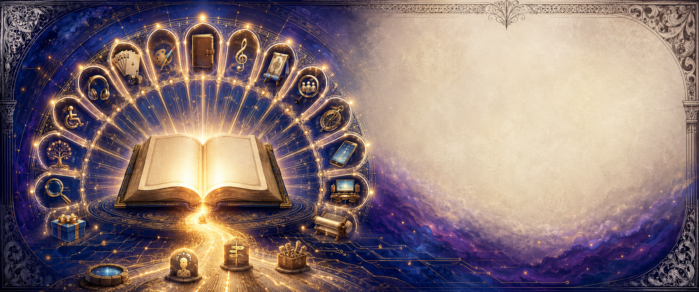

# 🧰 מפת הפיתוח של אוצר הקדושה — **KedushaWorks (KW)**

### *Kedusha + Works | קדושה שהופכת לעבודה מעשית*

אחי היקר, על בסיס 16 שערי הספר והתוצרים שכבר הכנו — הסיכום, 128 הליקוטים, 16 הקלפים והמאגר — בניתי מפת המשך של **128 כלים וחומרי צידה חדשים**.

כל תוצר יתבסס על מבנה קבוע:

> 📖 מקור מן הספר → 💭 התבוננות → 🎯 בחירה → 🛠️ פעולה → ✅ מעקב

---

## 🃏 1. משחקי קלפים — 01–08

1. 🧭 **קלפי 16 השערים** — הרחבת החפיסה הקיימת עם דרגות קושי.
2. 🔗 **משחק זיכרון** — התאמת שער, משפט אור, פעולה ומראה מקום.
3. ⚖️ **מלכודת מול תיקון** — התאמת מצב מאתגר לכלי המעשי המתאים.
4. 🚦 **מצב–בחירה–תוצאה** — שלושה קלפים היוצרים שרשרת החלטה.
5. 👁️ **קלפי עין טובה** — מציאת נקודה טובה באדם, באירוע ובעצמי.
6. 💬 **קלפי שיחה** — שאלות לפתיחת שיח אישי, זוגי או קבוצתי.
7. 🤝 **חפיסה שיתופית** — כל המשתתפים פועלים יחד להגיע מן הבוץ אל האור.
8. 🌅 **קלף יומי** — שער, תפילה קצרה, פעולה וסימון ביצוע.

## 🎲 2. משחקי שולחן וחוויה — 09–16

9. 🗺️ **מסע 16 השערים** — לוח התקדמות מ״דמעת העשוקים״ עד ״מאירת עיניים״.
10. 🪜 **סולם התשובה** — התקדמות באמצעות תפילה, תורה, שמחה, חסד ושמירה.
11. 🧩 **פאזל מפת הקדושה** — 128 חלקים, חלק לכל ליקוט.
12. 🕯️ **שולחן האור** — משחק שאלות המתאים לשבת ולמפגש משפחתי.
13. 🔐 **חדר בריחה: ברח מהמלכודת** — חידות המבוססות על שערים 3–4.
14. 🌊 **צא מהבוץ** — משחק שיתופי שבו בונים שגרה לפני שמד ההרגל מתמלא.
15. 🧠 **בחירה בדרך** — משחק עלילתי עם מסלולים ותוצאות שונות.
16. 🏆 **אתגר ארבעים הימים** — לוח משימות משותף לקבוצה או למשפחה.

## 🎨 3. דפי צביעה ויצירה — 17–24

17. 🖍️ **16 דפי צביעה** — איור סמלי נפרד לכל שער.
18. ✨ **128 איורי ליקוטים** — דפי צביעה קטנים עם משפט קצר.
19. 🔷 **גאומטריית הקדושה** — עיטורים סימטריים בהשראת אור, עין, דרך ושער.
20. 🔤 **אותיות מאירות** — כותרות השערים כקליגרפיה לצביעה.
21. 📖 **קומיקס לצביעה** — סיפור חזותי מן המלכודת אל הבחירה.
22. ✂️ **ערכת גזירה וקיפול** — סימניות, קלפים, מעטפות ותיבות תפילה.
23. 🔢 **חבר את הנקודות** — סמלים המתגבשים דרך פעולה הדרגתית.
24. 🖨️ **חבילת שחור־לבן** — מהדורה חסכונית להדפסה ביתית ולכיתות.

## 📝 4. שאלונים וחוברות עבודה — 25–32

25. 🧭 **שאלון 16 המידות** — מיפוי אישי מול כל שער.
26. 📊 **שאלון לפני ואחרי** — מדידת שינוי בתחילת מסלול ובסיומו.
27. 🔍 **מפת טריגרים** — זיהוי זמן, מקום, רגש, מחשבה ותגובה.
28. 🗣️ **בדיקת שמירת הפה** — כעס, מחלוקת, תגובה ושלום.
29. 👁️ **מפת תזונת העיניים** — בחינת התוכן החזותי שנכנס ליום.
30. 🌙 **חשבון נפש יומי** — מה סגר אותי, מה פתח אותי ומה אעשה מחר.
31. 📚 **שאלות חזרה** — שמונה שאלות לכל אחד מ־16 השערים.
32. 🎯 **תכנית דרך אישית** — בחירת שלושה שערים ושלוש פעולות קבועות.

## 📔 5. יומנים ומעקבי התקדמות — 33–40

33. 🌱 **יומן ארבעים יום** — פעולה, תפילה, לימוד ונקודת ניצחון יומית.
34. 🗓️ **יומן 16 שבועות** — שבוע עבודה לכל שער.
35. 🌙 **פנקס חשבון נפש לילי** — עמוד קצר וקבוע לסוף היום.
36. 🔄 **יומן נפילה–עצירה–חזרה** — תיעוד התאוששות ללא שקיעה בייאוש.
37. 🙏 **יומן תפילות אישיות** — בקשה, פעולה, תשובה והודיה.
38. 👁️ **יומן עין טובה** — שלוש נקודות טובות הנרשמות בכל יום.
39. 😊 **יומן שמחה וחסד** — פעולה משמחת ומעשה חסד יומי.
40. 🏅 **לוח ניצחונות קטנים** — מדידה של התמדה ולא רק של תוצאה סופית.

## 🎵 6. שירים, ניגונים ושמע — 41–48

41. 🎙️ **אלבום 16 השערים** — שיר מלא לכל פרק.
42. 🎼 **שיר נושא: מאפלה להארה** — המסע השלם של הספר בשיר אחד.
43. 🔁 **16 פזמוני זיכרון** — פזמון קצר וקליט לכל שער.
44. 📖 **ספר שמע** — הקראת הסיכומים והליקוטים.
45. 🕊️ **הדרכות התבודדות מוקלטות** — פתיחה, שקט, דיבור וסיום.
46. 🎻 **אלבום ניגונים ללא מילים** — מוזיקה לתפילה, לימוד וכתיבה.
47. 👨‍👩‍👧 **שירי משפחה** — ניסוח רך ומותאם גיל על בחירה, שמחה ועין טובה.
48. 🎧 **הסכת בן 16 פרקים** — לימוד, סיפור, שאלה ואתגר שבועי.

## 🙏 7. תפילה והתבוננות — 49–56

49. 📗 **סידור תפילות מן השערים** — ליקוט תפילות לפי נושא.
50. ✍️ **תבניות לתפילה אישית** — השלמת משפטים בשפה טבעית.
51. 🕯️ **16 תפילות קצרות** — תפילה אחת לכל שער.
52. 🌅 **תפילת פתיחת היום** — שמירת המחשבה, המבט והבחירה.
53. 🌙 **תפילת סיום היום** — הודיה, וידוי, סליחה והתחלה חדשה.
54. 🛟 **תפילה לאחר מעידה** — כלי חזרה מיידי המונע ייאוש.
55. 📜 **מפת הפסוקים** — הפסוקים המרכזיים ולצדם פעולת יום.
56. 🌌 **קלפי התבוננות בחיות האלוקית** — מעבר מראייה חיצונית לפנימית.

## 👨‍👩‍👧‍👦 8. כלים למשפחה ולילדים — 57–64

57. 📘 **אוצר הקדושה למשפחה** — עיבוד רך וקצר של 16 השערים.
58. ⭐ **טבלת מדבקות** — שמחה, דיבור טוב, עין טובה ועזרה בבית.
59. 📚 **16 סיפורי ילדים** — עלילה מוסרית המבוססת על כל שער.
60. 🎭 **תיאטרון בובות** — התמודדות בין קול הייאוש לקול ההתחלה.
61. 🧩 **משחק התאמת בחירות** — איזו פעולה מתאימה לכל מצב.
62. 💞 **קלפי הורה–ילד** — שאלה, סיפור, מעשה טוב וברכה.
63. 🏡 **סדנת בית קדוש** — בניית כללי בית משותפים לתוכן, דיבור ושלום.
64. 📜 **אמנת משפחה מאירה** — מסמך מעוצב לתלייה ולחתימה משותפת.

## 📱 9. נוער והרגלים דיגיטליים — 65–72

65. ⚡ **מהדורת נוער** — ניסוח ישיר, קצר וחזותי של הספר.
66. 📵 **ערכת גבולות למסכים** — זמנים, אזורים, חסימות וחלופות.
67. 📊 **שאלון הרגלים דיגיטליים** — טריגרים, גלילה, שינה וריכוז.
68. 🎬 **תרחישי בחירה** — מקרים קצרים לדיון בכיתה או בקבוצה.
69. 🧑‍🤝‍🧑 **מדריך מנהיג צעיר** — כיצד לחזק חבר בלי לבייש אותו.
70. 🖼️ **קומיקס דיגיטלי** — 16 פרקים קצרים מותאמים לנייד.
71. 🔥 **אתגר 21 יום של מבט נקי** — משימות, חלופות ומעקב.
72. 🧑‍🏫 **מערכי שיעור לנוער** — פתיחה, מקור, פעילות, שיח ומשימת בית.

## 🤝 10. קבוצות, חברותות ומנחים — 73–80

73. 🪑 **מדריך 16 מפגשים** — מפגש קבוצתי לכל שער.
74. ⏱️ **תבנית מפגש של 45 דקות** — פתיחה, לימוד, שיתוף, פעולה וסיום.
75. 🕯️ **טקס פתיחה וסגירה** — יצירת מסגרת מכבדת וקבועה.
76. 🎴 **קלפי הנחיה** — שאלות עומק, עצירה, סיכום והתחייבות.
77. 📥 **תיבת שאלות אנונימית** — מקום בטוח לנושאים אישיים.
78. 👥 **ערכת חברותא** — דף מקור, שאלות הדדיות ופעולה שבועית.
79. 🧑‍🏫 **סדנת הכשרת מנחים** — תוכן, גבולות, שפה והקשבה.
80. 🌐 **שולחן לימוד מרחוק** — חדר משותף עם קלף, תור דיבור וסיכום.

## 🎒 11. צידה מודפסת וניידת — 81–88

81. 📕 **חוברת כיס A6** — 16 שערים בתמצית מעשית.
82. 🪗 **מפת אקורדיון מתקפלת** — כל המסע על דף אחד.
83. 🖼️ **16 כרזות** — שער, משפט אור, פעולה ופסוק.
84. 🗺️ **כרזת־על של מפת הדרך** — חיבור כל השערים למסלול אחד.
85. 🔖 **16 סימניות** — אחת לכל פרק.
86. 🧲 **מגנטים יומיים** — תזכורות לתפילה, לימוד, שמחה ושמירה.
87. ✨ **מדבקות פעולה** — ״עצרתי״, ״בחרתי״, ״התפללתי״, ״התחלתי מחדש״.
88. 📜 **מגילת מסע ארוכה** — גלילה חזותית של כל 16 השערים.

## 🌐 12. כלים דיגיטליים — 89–96

89. 📲 **יישומון קלף יומי** — הצגת שער ופעולה גם ללא אינטרנט.
90. 🔎 **מנוע חיפוש ב־128 הליקוטים** — לפי נושא, שער ומילת מפתח.
91. 📈 **מסלול התקדמות אישי** — סימון שערים, פעולות ורצפים.
92. ❓ **מחולל שאלונים** — חידון משתנה מתוך תוכן הספר.
93. 🎲 **מחולל פעולה יומית** — התאמת פעולה לזמן ולשער שנבחר.
94. 🔒 **יומן פרטי מקומי** — שמירת התשובות במכשיר בלבד.
95. 🎧 **נגן שמע לא מקוון** — שיעורים, ניגונים ותפילות.
96. ♿ **מצב נגיש** — גופן גדול, ניגודיות גבוהה, ניקוד והקראה.

## 🎬 13. המחשה, מדיה ותצוגה — 97–104

97. 📊 **16 אינפוגרפיקות** — מפת הרעיונות של כל שער.
98. 📚 **ספר קומיקס מלא** — מסע דמות מן הנפילה אל המבט המאיר.
99. 🎞️ **16 סרטוני אנימציה** — הסבר חזותי קצר לכל פרק.
100. 🌠 **קדימון קולנועי** — הצגת החזון של אוצר הקדושה.
101. 📱 **128 סרטונים קצרים** — ליקוט, הסבר ופעולה בפחות מדקה.
102. 🖥️ **מצגת לימוד** — שקופית מרכזית לכל שער ולכל פעילות.
103. 🏛️ **תערוכה נודדת** — כרזות, קלפים, שמע ועמדות כתיבה.
104. 🌄 **16 רקעים למסך** — משפטי אור לתזכורת יומית.

## 🌍 14. נגישות, שפות ומהדורות — 105–112

105. 🔤 **מהדורה עברית מנוקדת** — משפטי מפתח ותפילות בניקוד מלא.
106. 🟢 **עברית קלה** — משפטים קצרים והסברים בהירים.
107. 🔎 **מהדורת אותיות גדולות** — למבוגרים ולקוראים עם קושי ראייתי.
108. 🎙️ **מהדורת שמע נגישה** — ניווט לפי שער וקטע.
109. 🤟 **תסריטי שפת סימנים** — הכנה לסדרת סרטונים מונגשת.
110. ⠿ **קובץ מוכן להפקת ברייל** — כותרות, פעולות ותפילות קצרות.
111. 🇷🇺 **מהדורה רוסית** — ספרון, קלפים וממשק.
112. 🇬🇧 **מהדורה אנגלית** — ספרון, קלפים וממשק מקביל.

## 📚 15. מחקר, מפתחות ומאגר ידע — 113–120

113. 📜 **מפתח פסוקים** — ספר, פרק, פסוק והשער שבו הוא מופיע.
114. 🔡 **מפתח נושאים אלפביתי** — תפילה, שמחה, כעס, ברית, עיניים ועוד.
115. 📖 **מילון מושגים** — הסבר קצר למונחי ברסלב ועבודת המידות.
116. 🌳 **מפת מקורות** — פסוקים, חז״ל, רבי נחמן, רבי נתן והמחבר.
117. 🕸️ **גרף קשרים** — חיבור בין נושא, שער, ליקוט ותרגול.
118. ⚖️ **טבלת השוואת השערים** — בעיה, שורש, כלי ותוצאה.
119. 📝 **סימון ציטוט מול עיבוד** — שקיפות מלאה בכל חומר עתידי.
120. 🧑‍🏫 **ערכת עיון למלמד** — מראי מקום ושאלות הרחבה לכל מפגש.

## 📦 16. ערכות, מהדורות וקהילה — 121–128

121. 🎁 **מארז אוצר הקדושה** — ספרון, קלפים, יומן, סימניות וכרזה.
122. 🧑‍🏫 **ערכת מנחה** — מדריך, מצגת, קלפי שיחה וטפסי סיכום.
123. 🏫 **ערכת מוסד לימוד** — מערכי שיעור, דפי עבודה וחומרי הדפסה.
124. 🏡 **ערכת משפחה** — משחק, סיפורים, אמנה ולוח מעקב.
125. 🗓️ **לוח גרסאות שנתי** — תוצר מרכזי חדש בכל חודש.
126. ✅ **תקן איכות פנימי** — נאמנות למקור, עברית, נגישות ובדיקת דפוס.
127. 💬 **מערכת משוב ויומן גרסאות** — כל הצעה נכנסת לתהליך מסודר.
128. 🌟 **מהדורה חיה** — קהילה מוסיפה תפילות, שירים ותרגולים שעוברים עריכה ובקרה.

---

## 🚀 סדר הפיתוח המומלץ

| גרסה      | חבילת פיתוח     | תוצרים מרכזיים                                           |
| --------- | --------------- | -------------------------------------------------------- |
| **1.1.0** | 📝 צידה יומית   | יומן 40 יום, שאלון 16 המידות, חשבון נפש ומפת טריגרים     |
| **1.2.0** | 🎨 יצירה והדפסה | 16 דפי צביעה, חוברת כיס, סימניות וכרזת המסע              |
| **1.3.0** | 🎲 משחק ולימוד  | משחק זיכרון, קלפי מצב–בחירה–תוצאה וחידון 128 הליקוטים    |
| **1.4.0** | 🎵 קול ונשמה    | 16 שירים, תפילות מוקלטות והסכת בן 16 פרקים               |
| **1.5.0** | 🤝 חבורה ומשפחה | מדריך 16 מפגשים, ערכת חברותא ומשחק שולחן משפחתי          |
| **2.0.0** | 🌐 מערכת מאוחדת | יישומון, מסלול אישי, שמע, שאלונים, יומן וחדר לימוד משותף |

## 🥇 ארבעת התוצרים שכדאי ליצור ראשונים

1. 📔 **יומן ארבעים יום** — הכלי המעשי והישיר ביותר.
2. 🎨 **16 דפי צביעה** — תוצר יפה, נגיש ומהיר להפצה.
3. 🎲 **משחק מצב–בחירה–תוצאה** — הופך את העקרונות לאימון בהחלטות.
4. 🎵 **אלבום 16 השערים** — מעניק לספר קול, זיכרון ורגש.

## 📖 בסיס וקרדיטים

התכנון נשען על 16 הקונטרסים ועל מהלך הספר: כאב ואי־ייאוש, חשבון נפש, יציאה מהרגל, תפילה, תורה, שמחה, תיקון המידות, שמירת הברית, שמירת העיניים, אמונה וראיית החיות האלוקית.

📎 [ספר המקור — אוצר הקדושה, רבי אליעזר שלמה שיק](sandbox:/workspace/scratch/bfdfa9ba9252/project_sources/01-pdf)

🙏 קרדיטים: רבי אליעזר שלמה שיק; [Breslev City](https://breslevcity.co.il/); [HebrewBooks](https://www.hebrewbooks.org/); [Cyber Shamanic](https://github.com/Cyber-Shamanic); [AnLoMinus](https://github.com/AnLoMinus).

🗓️ יום חמישי, כ״ג באב ה׳תשפ״ו — 6 באוגוסט 2026, בשעה 06:03 לפי שעון ישראל.

**🔢 מספר המידות:** 16 משפחות פיתוח • 128 רעיונות • 6 גרסאות דרך • 4 תוצרים לפתיחה.

> ✨ ״הוֹרֵנִי ה׳ דַּרְכֶּךָ; אֲהַלֵּךְ בַּאֲמִתֶּךָ, יַחֵד לְבָבִי לְיִרְאָה שְׁמֶךָ״ — תהלים פו, יא.
