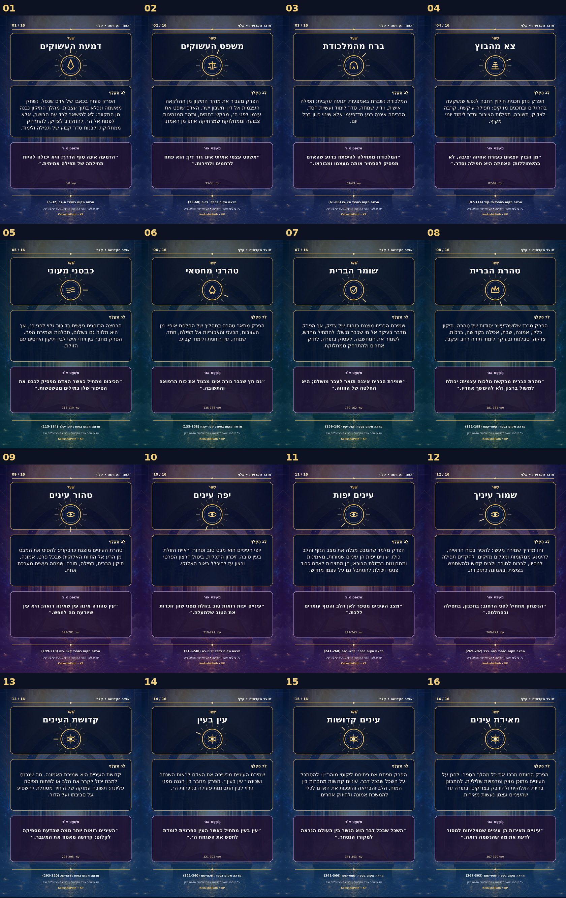

<div dir="rtl">

# 🕯️ אוצר הקדושה — KedushaVault (KV)

[](CHANGELOG.md)
[](index.html)
[](cards/preview/KedushaPath_Fronts_Preview.jpg)
[](documents/Otzar_HaKedusha_Full_Summary_HE.pdf)

מאגר מלא ללימוד, סיכום, תרגול והדפסה המבוסס על הספר **״אוצר הקדושה״** מאת רבי אליעזר שלמה שיק. המהדורה מאגדת את ספר המקור, מסמך סיכום וליקוטים בן 38 עמודים, סדרת 16 קלפים דו־צדדיים, כריכות, קובצי דפוס, קוד ההפקה ואתר גלריה עברי — בחבילה אחת המוכנה להעלאה ל־GitHub.



## ✨ מה כלול

| תחום | תכולה | נתיב |
|---|---:|---|
| 📖 ספר המקור | 417 עמודים | [`book/`](book/) |
| 📘 סיכום מלא | PDF בן 38 עמודים + Word | [`documents/`](documents/) |
| 🃏 סדרת קלפים | 16 חזיתות + 16 גביים | [`cards/`](cards/) |
| 🎨 כריכות | כריכה קדמית ואחורית | [`cards/covers/`](cards/covers/) |
| 🖨️ דפוס מקצועי | PDF ‏10×15 ס״מ + A4 דו־צדדי | [`cards/print/`](cards/print/) |
| 🌐 אתר גלריה | RTL, חיפוש, סינון, היפוך קלפים ומצב כהה | [`index.html`](index.html) |
| 🛠️ קוד הפקה | חילוץ, מסמך, קלפים ובדיקת תקינות | [`scripts/`](scripts/) |
| 🗺️ תכנית המשך | 100 משימות מסודרות לפי נושאים | [`TODO.md`](TODO.md) |

## 🚀 התחלה מהירה

1. הורידו או שכפלו את המאגר.
2. פתחו את `index.html` או הריצו שרת מקומי:

```bash
python3 -m http.server 8000
```

3. גלשו אל `http://localhost:8000`.
4. להדפסה מקצועית פתחו את `cards/print/KedushaPath_16_Cards_Print_10x15cm.pdf`.

## 🖨️ הוראות הדפסה קצרות

- גודל סופי: **10×15 ס״מ**.
- רזולוציה: **300 DPI**.
- Bleed: **3 מ״מ** מכל צד.
- הדפסה ביתית: קובץ A4, גודל 100%, ללא ״התאם לעמוד״, דו־צדדי והיפוך בצלע הארוכה.
- חומר מומלץ: כרומו מט 300–350 גרם, למינציה מטה ופינות מעוגלות 3–5 מ״מ.

להוראות מלאות: [`docs/PRINTING_HE.md`](docs/PRINTING_HE.md).

## 🧭 שישה־עשר השערים

1. דמעת העשוקים
2. משפט העשוקים
3. ברח מהמלכודת
4. צא מהבוץ
5. כבסני מעוני
6. טהרני מחטאי
7. שומר הברית
8. טהרת הברית
9. טהור עינים
10. יפה עינים
11. עינים יפות
12. שמור עיניך
13. קדושת העינים
14. עין בעין
15. עינים קדושות
16. מאירת עינים

## 🧪 בדיקת תקינות

```bash
python3 scripts/validate_repo.py
```

הבדיקה מאמתת את מספר הקלפים, הכריכות, המסמכים, נתוני הפרקים, קישורי האתר וגבולות הגודל של קובצי GitHub.

## 🌐 פרסום ב־GitHub Pages

המאגר כולל תהליך פרסום מוכן תחת `.github/workflows/pages.yml`. לאחר העלאה:

1. היכנסו ל־**Settings → Pages**.
2. בחרו **GitHub Actions** כמקור הפרסום.
3. הריצו את תהליך **Deploy GitHub Pages** או בצעו Push לענף `main`.

## 🙏 מקור, קרדיטים וזכויות

- מקור: **אוצר הקדושה**, רבי אליעזר שלמה שיק.
- עריכה, ליקוט, אפיון ועיצוב: **Cyber Shamanic (CySh)** — [GitHub](https://github.com/Cyber-Shamanic).
- יוזמה ויצירה: **לאון יעקובוב (AnLoMinus)** — [LinkedIn](https://www.linkedin.com/in/anlominus/) · [GitHub](https://github.com/AnLoMinus) · [Facebook](https://www.facebook.com/AnlominusX) · [CodePen](https://codepen.io/Anlominus).
- מאגרי המקור המוזכרים במהדורה: [Breslev City](https://breslevcity.co.il/) · [HebrewBooks](https://www.hebrewbooks.org/).
- פרטי הזכויות המדויקים לכל שכבה מופיעים ב־[`LICENSE.md`](LICENSE.md) וב־[`SOURCE_NOTICE.md`](SOURCE_NOTICE.md).

## 📬 יצירת קשר

- דוא״ל: [GlobalElite8200@gmail.com](mailto:GlobalElite8200@gmail.com)
- WhatsApp: [054-328-5967](https://wa.me/972543285967) · [053-536-6687](https://wa.me/972535366687)

## 🔢 מספר המידות

**16 שערים • 16 קלפים • 32 צדדים • 64 פעולות • 16 שאלות דרך • 128 ליקוטים • 417 עמודי מקור**

> ״לֵב טָהוֹר בְּרָא לִי אֱלֹהִים; וְרוּחַ נָכוֹן חַדֵּשׁ בְּקִרְבִּי״ — תהלים נא, יב.

🗓️ מהדורה 1.0.0 — יום חמישי, כ״ג באב ה׳תשפ״ו — 6 באוגוסט 2026.

</div>
